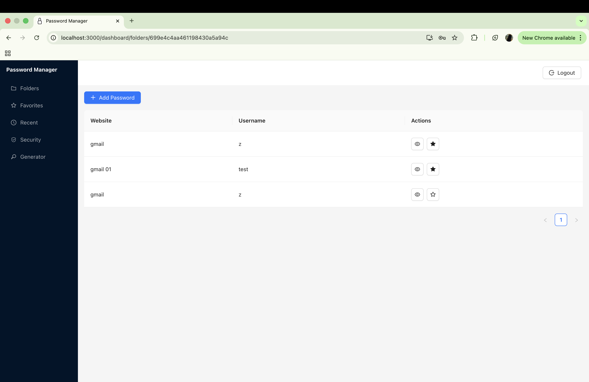
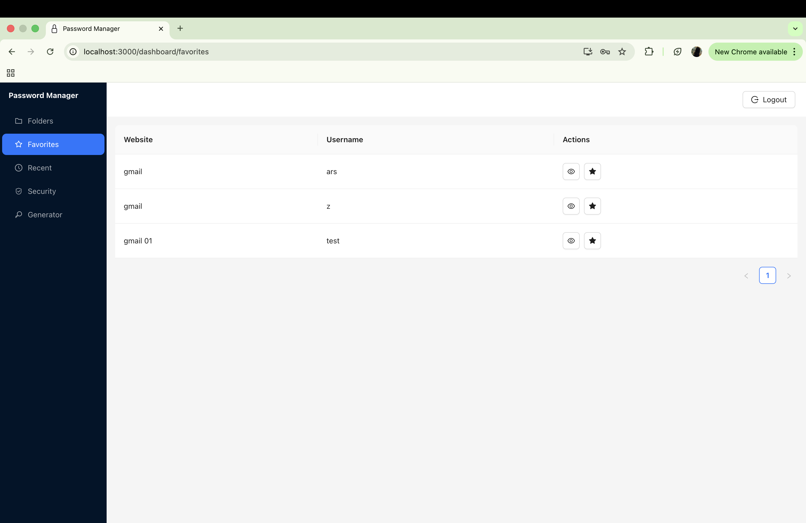
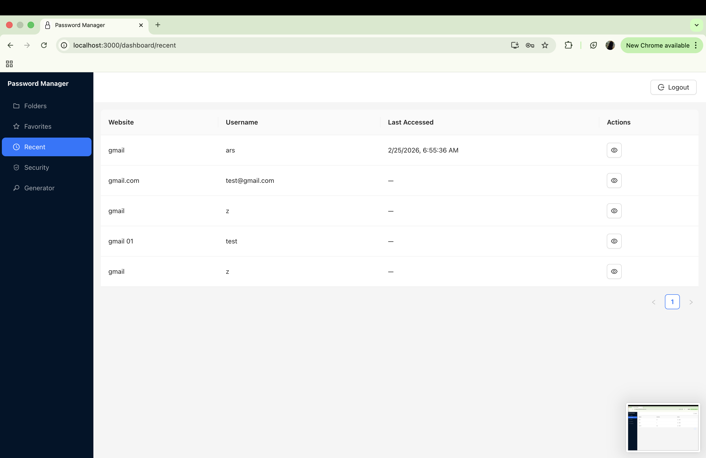
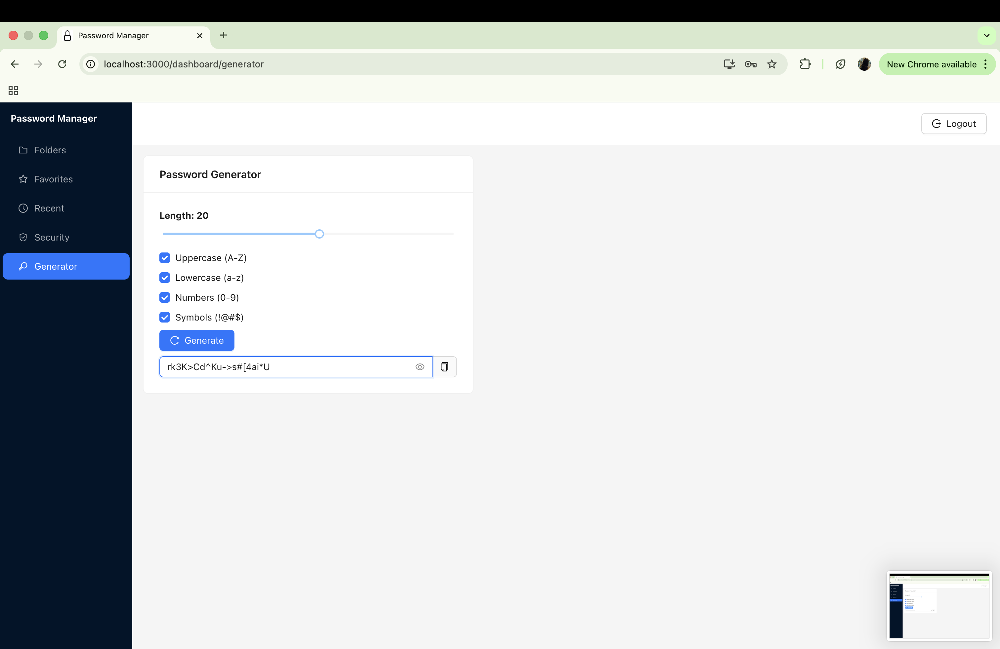

# 🔐 Password Manager (MERN Stack)

A secure, full-stack **Password Manager** built using the **MERN stack**, focusing on real-world **authentication, encryption, and security best practices**.

This project demonstrates how sensitive user data can be safely stored, encrypted, and accessed in a production-style application.

---

## 🌐 Live Demo

- [https://password-manager.vercel.app  ](https://password-manager-sigma-roan.vercel.app/dashboard)

---

## 🚀 Features

### 🔐 Authentication
- User registration & login
- Password hashing using **bcrypt**
- JWT-based authentication
- Protected routes and APIs

### 🗂 Folder-Based Organization
- Create and manage folders
- Each password belongs to a folder
- Folder-scoped access control

### 🔑 Secure Password Vault
- Passwords encrypted using **AES-256-GCM**
- Unique **Initialization Vector (IV)** per password
- **Auth tag** for tamper detection
- Passwords decrypted only on explicit user action

### ⭐ Favorites & ⏱ Recent
- Mark passwords as favorites
- Track recently accessed passwords
- Recent list updates only on decrypt

### 🛡 Security Health Dashboard
- Detect weak passwords
- Detect reused passwords using **SHA-256 fingerprinting**
- Visual security metrics

### 🔑 Password Generator
- Generate strong passwords
- Configurable length & character sets
- Backend-driven generation logic

### 🎨 Modern UI
- React + Ant Design
- Dashboard layout with sidebar navigation
- Loaders for async actions
- Clean and responsive UI

---

## 🏗 Tech Stack

### Frontend
- React
- React Router
- Ant Design
- Axios

### Backend
- Node.js
- Express.js
- MongoDB + Mongoose
- JWT Authentication
- Crypto (AES-256-GCM)

---

## 🔐 Security Design

- Login passwords are **hashed**, not encrypted
- Vault passwords are **encrypted**, never stored in plain text
- Encryption key stored in environment variables
- Password reuse detection without decrypting passwords
- Decryption allowed only for authenticated users

> ⚠️ This is an MVP-level secure design.  
> In production, per-user encryption keys and zero-knowledge encryption can be implemented.

---

## 📸 Screenshots

### Folders Dashboard

### Password Vault

### Security Health

### Password Generator

## ⚙️ Environment Variables

---

## 🚀 Deployment

- Frontend: Vercel
- Backend: Render
- Database: MongoDB Atlas

## 👨‍💻 Author

- Arshiya

---
